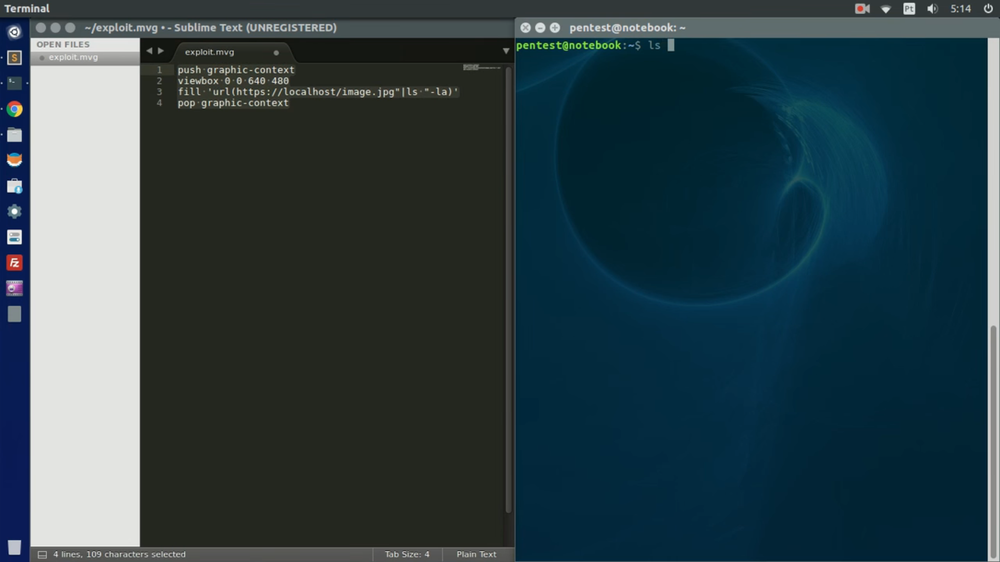

<h1>Working of Exploit</h1> 

<h2>Library	: ImageMagick   Tool		: Convert (Unix)</h2>  

<h2>Exploit</h2> 

Here is the exploit that is used in exploiting the given library and tool.

 

 

<h2>Working</h2> 

By using the command given below we can execute the exploit.

 

<h2>Result</h2> 

As a result of these exploit, we can run any command we want and get output.

 

