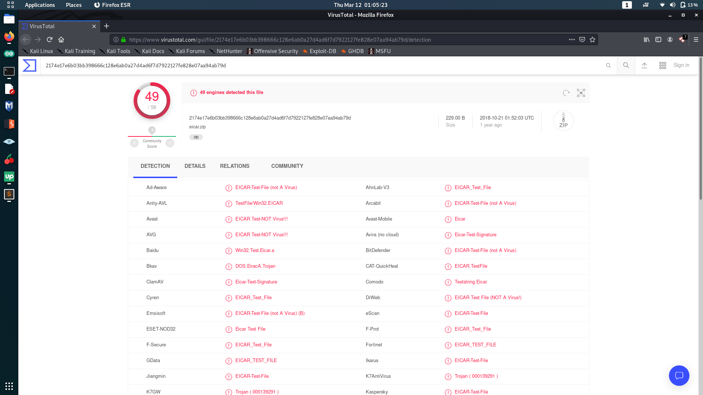
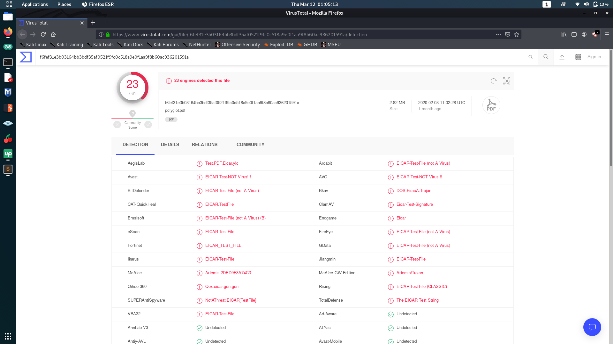

<h1>PoC of Malware being hidden inside polyglot files : </h1>
  

 We have a pdf file called normal.pdf and we also have a virus in eicar.zip file. With the use of tools to create polyglot file, We merged these two files and got polyglot.pdf file. That file resembles architecture of pdf more than zip file. Here is the Virustotal result of files. 
 

<h2>Virustotal result of eicar.zip : </h2>

 

<h2>Virustotal result of Polyglot.pdf file : </h2>

 

All files are found under "files" folder.
