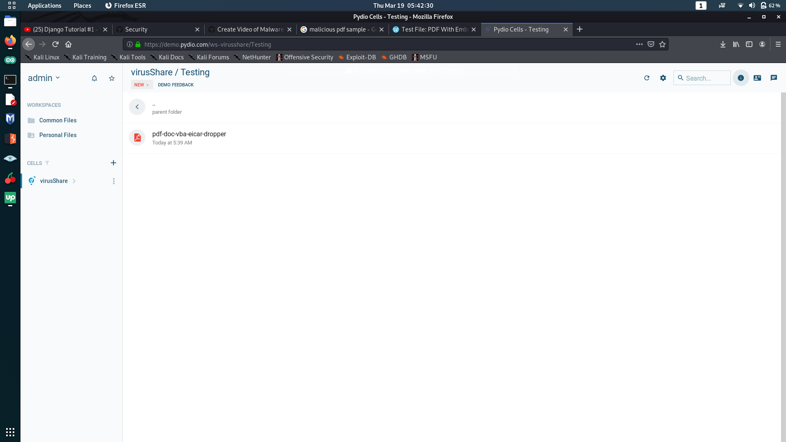
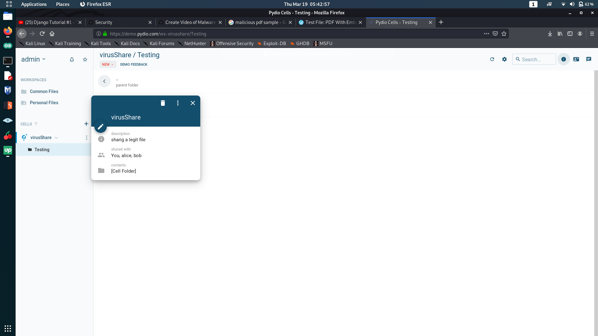
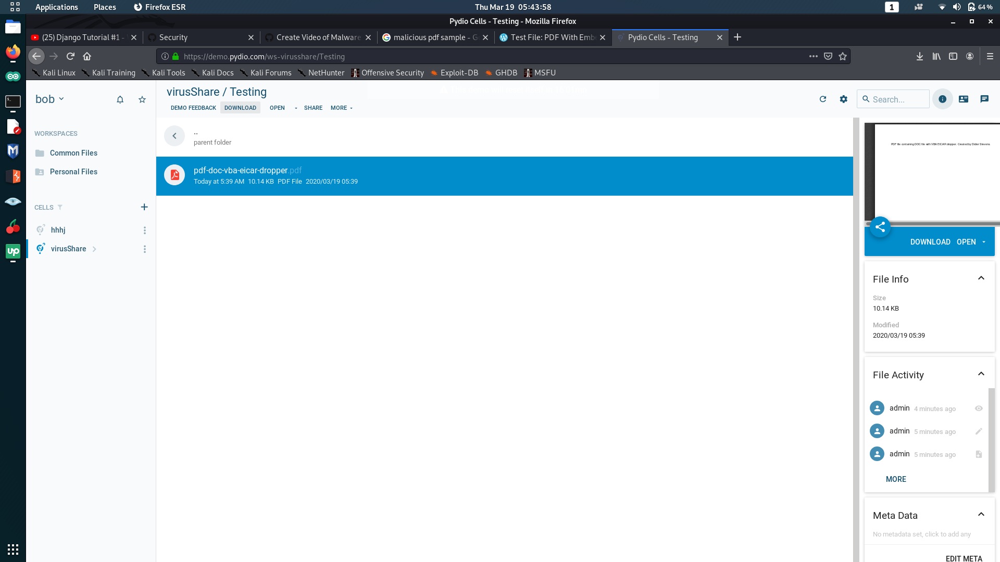
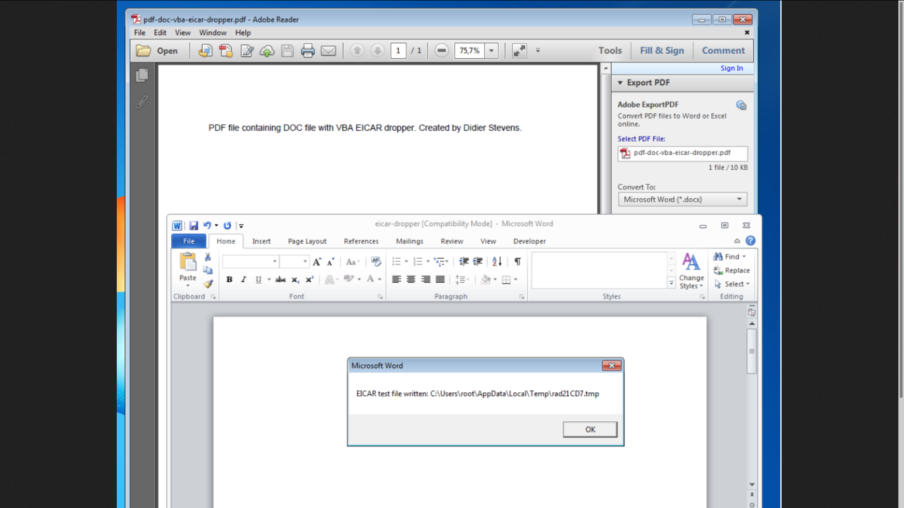
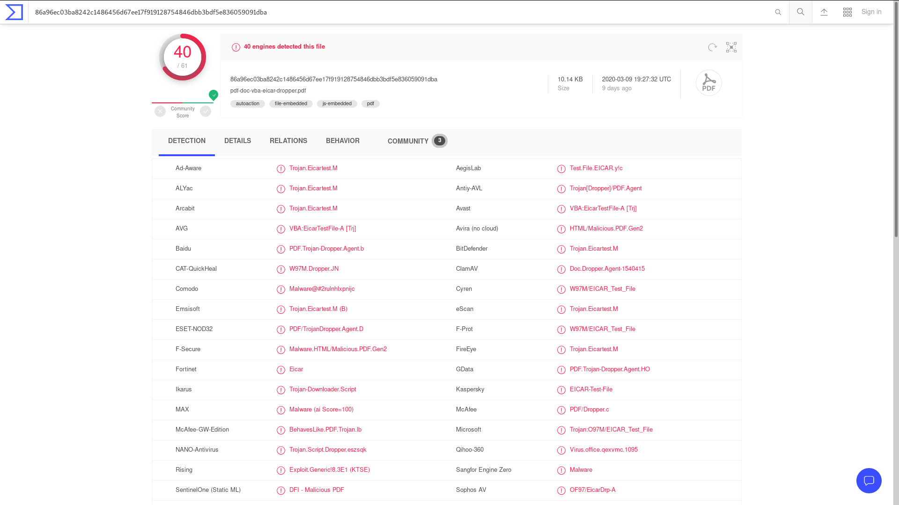

<h1> Virus infection via Pydio </h1>  

<h2>Admin Account</h2> 

We first upload file in "Testing" folder. Then we created new cell called "virusShare".
 
 

Then we shared the file with Bob.
 
 

<h2>Bob Account</h2> 

We first login into Bob's account. We can see "virusShare" cell on his home page as we shared it with him.
 
 

Bob gets the pdf and downloads it in his computer. 
 
 

<h2>Malicious file details</h2> 

When we open the file we get this.
 
 

Here is the virus total results and reports.
 
 

You can read extra details about file <a href="https://www.virustotal.com/gui/file/86a96ec03ba8242c1486456d67ee17f919128754846dbb3bdf5e836059091dba/detection">here</a>.
